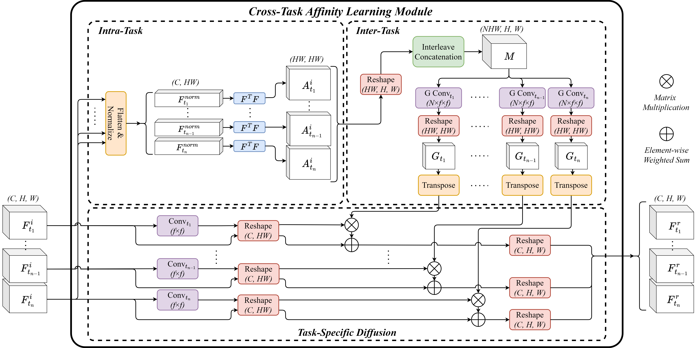

# EMA-Net: Efficient Multitask Affinity Learning for Dense Scene Predictions
PyTorch implementation of the paper: "EMA-Net: Efficient Multitask Affinity Learning for Dense Scene Predictions".


## Getting Started
### Download the datasets:
1. [NYUv2](https://www.dropbox.com/sh/86nssgwm6hm3vkb/AACrnUQ4GxpdrBbLjb6n-mWNa?dl=0)
2. [Cityscapes](https://www.dropbox.com/sh/gaw6vh6qusoyms6/AADwWi0Tp3E3M4B2xzeGlsEna?dl=0)

### Download the pretrained weights:
1. Download weights from [here](https://github.com/HRNet/HRNet-Image-Classification) (HRNet-W18-C-Small-v2).
2. Save them to ```models\pretrained_models\hrnet_w18_small_model_v2.pth```.

## Training the Models:
1. Set the ```db_root``` (dataroot) in ```configs/mypath.py``` to where you stored the dataset.
2. Set the ```--storage_root``` and ```--config``` in ```train.sh```
3. Run ```train.sh```

## Citation
You can find the preprint of our paper on [arXiv](https://arxiv.org/abs/2401.11124).

Please cite our paper if you use the code or the results of our work.
```bibtex
@article{sinodinos2024ema,
  title={EMA-Net: Efficient Multitask Affinity Learning for Dense Scene Predictions},
  author={Sinodinos, Dimitrios and Armanfard, Narges},
  journal={arXiv preprint arXiv:2401.11124},
  year={2024}
}
```

## Abstract
> Multitask learning (MTL) has gained prominence for its ability to jointly predict multiple tasks, achieving better per-task performance while using fewer per-task model parameters than single-task learning. More recently, decoder-focused architectures have considerably improved multitask performance by refining task predictions using the features of other related tasks. However, most of these refinement methods fail to simultaneously capture local and global task-specific representations, as well as cross-task patterns in a parameter-efficient manner. In this paper, we introduce the Efficient Multitask Affinity Learning Network (EMA-Net), which is a lightweight framework that enhances the task refinement capabilities of multitask networks. EMA-Net adeptly captures local, global, and cross-task interactions using our novel Cross-Task Affinity Learning (CTAL) module. The key innovation of CTAL lies in its ability to manipulate task affinity matrices in a manner that is optimally suited to apply parameter-efficient grouped convolutions without worrying about information loss. Our results show that we achieve state-of-the-art MTL performance for CNN-based decoder-focused models while using substantially fewer model parameters.

## Acknowledgment
This repo borrows several elements from [Multi-Task-Learning-PyTorch](https://github.com/SimonVandenhende/Multi-Task-Learning-PyTorch) and [MTAN](https://github.com/lorenmt/mtan).